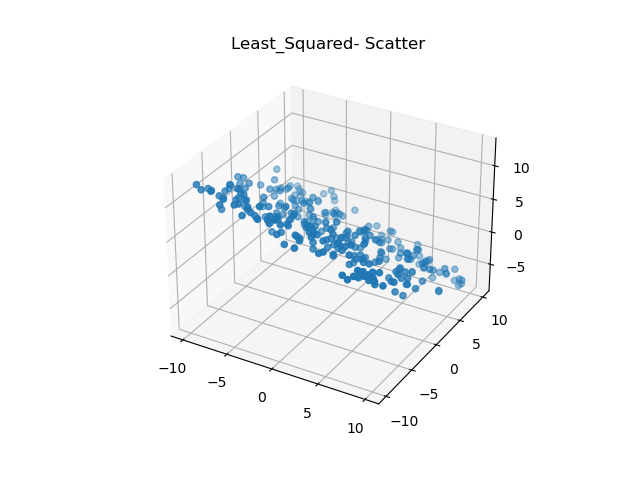
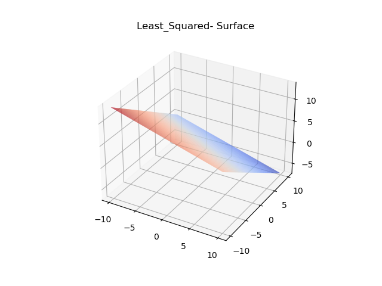
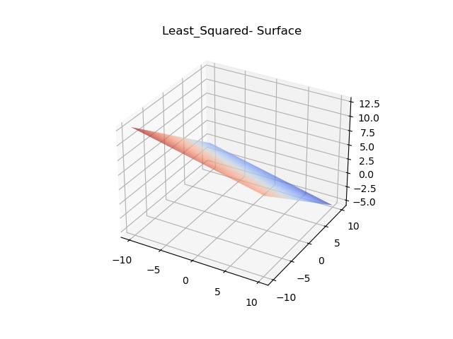
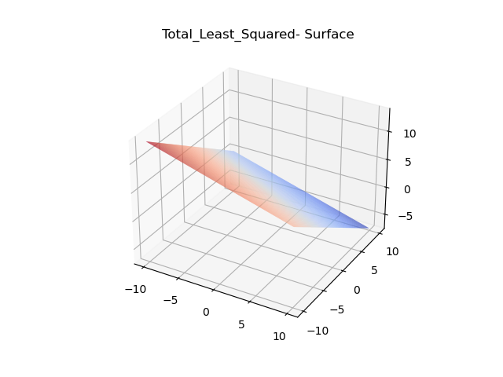
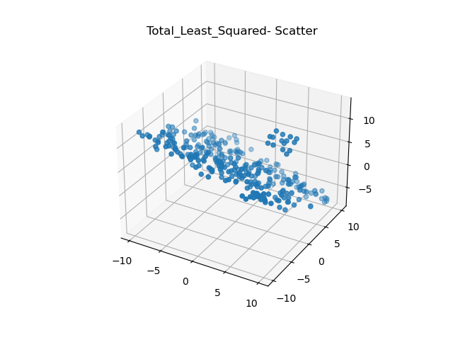
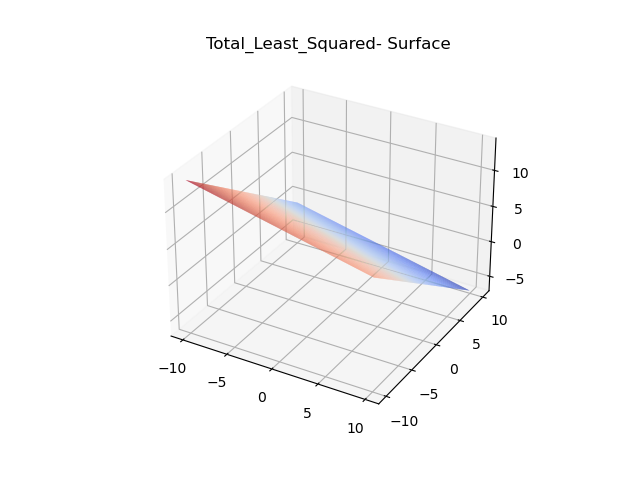
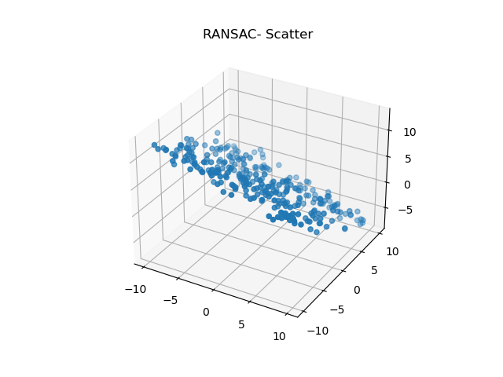
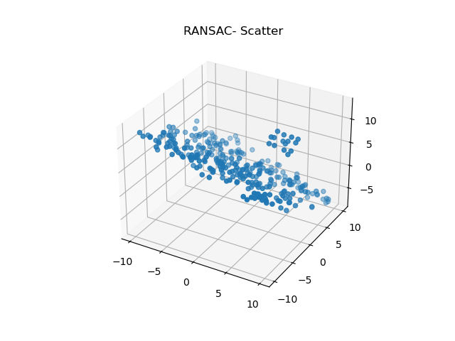
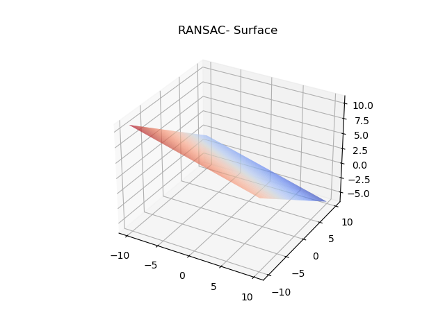

# Robust-3D-Plane-Fitting-using-SLS-TLS-and-RANSAC

## Overview
This project implements multiple plane fitting algorithms on noisy LiDAR point cloud data using C++ and Eigen.
The goal is to estimate and fit ground plane from noisy `(x, y, z)` point cloud measurements while handling outliers robustly.

Implemented methods:
- Covariance Matrix Computation
- Surface Normal Estimation using Eigenvalue Decomposition
- Standard Least Squares (SLS)
- Total Least Squares (TLS)
- RANSAC with Adaptive Iteration Estimation
- Statistical Thresholding using MAD (Median Absolute Deviation)

---

## Description

Given two CSV point cloud datasets:

- `pc1.csv`
- `pc2.csv`

containing noisy LiDAR ground plane measurements:

```text
x, y, z
```

the objective was to:

1. Compute covariance matrices
2. Estimate surface normals
3. Fit planes using:
   - Standard Least Squares
   - Total Least Squares
   - RANSAC
4. Compare robustness against outliers
5. Visualize fitted surfaces

---

# Project Pipeline

## 1. Reading Point Cloud Data

The CSV files are parsed and converted into Eigen vectors:

```cpp
x = Eigen::Map<Eigen::VectorXd>(x_vals.data(), x_vals.size());
y = Eigen::Map<Eigen::VectorXd>(y_vals.data(), y_vals.size());
z = Eigen::Map<Eigen::VectorXd>(z_vals.data(), z_vals.size());
```

---

# 2. Covariance Matrix Computation

The point cloud is centered using the mean:

```math
dx = x - \bar{x}
dy = y - \bar{y}
dz = z - \bar{z}
```

Covariance matrix:

```math
C =
\begin{bmatrix}
\sigma_x^2 & \sigma_{xy} & \sigma_{xz} \\
\sigma_{xy} & \sigma_y^2 & \sigma_{yz} \\
\sigma_{xz} & \sigma_{yz} & \sigma_z^2
\end{bmatrix}
```

---

# 3. Surface Normal Estimation

Eigenvalue decomposition is performed:

```math
Cv = \lambda v
```

The eigenvector corresponding to the smallest eigenvalue gives the surface normal direction.

Implementation:

```cpp
Eigen::SelfAdjointEigenSolver<Eigen::Matrix3d> solver(covarianceMatrix);
```

---

# 4. Standard Least Squares (SLS)

The plane is modeled as:

```math
z = ax + by + c
```

The pseudoinverse is computed manually using eigen decomposition and SVD principles:

```math
X^+ = V \Sigma^{-1} U^T
```

The fitted coefficients are:

```math
B = X^+ z
```

---

# 5. Total Least Squares (TLS)

TLS minimizes orthogonal point-to-plane distances.

Plane equation:

```math
a(x-\bar{x}) + b(y-\bar{y}) + c(z-\bar{z}) = 0
```

Steps:
1. Construct centered data matrix
2. Compute covariance matrix
3. Perform eigen decomposition
4. Smallest eigenvector → plane normal

TLS provides better geometric fitting compared to SLS because it considers errors in all axes.

---

# 6. RANSAC Plane Fitting

RANSAC was implemented completely from scratch.

## RANSAC Pipeline

### Step 1: Estimate Noise using TLS Residuals

Residuals:

```math
r_i = n \cdot p_i + d
```

where:
- `n` = normalized TLS normal
- `d` = plane offset

---

### Step 2: Robust Noise Estimation using MAD

Median Absolute Deviation:

```math
MAD = median(|r_i - median(r)|)
```

Noise standard deviation estimate:

```math
\sigma = 1.4826 \times MAD
```

Threshold:

```math
t = 1.96\sigma
```

This statistically estimates the inlier threshold assuming Gaussian noise.

---

### Step 3: Random Plane Sampling

For each iteration:
1. Randomly sample 3 unique points
2. Compute plane normal using cross product
3. Normalize the normal vector
4. Compute point-to-plane distances
5. Count inliers

Plane normal:

```math
n = (p_3 - p_1) \times (p_2 - p_1)
```

Plane offset:

```math
d = -n \cdot p_1
```

---

### Step 4: Adaptive RANSAC Iteration Estimation

The iteration count is updated dynamically:

```math
k =
\frac{
\log(1-p)
}{
\log(1-w^n)
}
```

where:
- `p` = desired probability
- `w` = inlier ratio
- `n = 3` (minimum plane sample size)

This significantly reduces unnecessary iterations.

---

# Results

## Standard Least Squares

### Scatter Plot
<p align="center">
  
  
</p>

### Surface Plot
<p align="center">
  
  
</p>

---

# Total Least Squares

### pc1 data
<p align="center">
  
  
</p>

### pc2 data
<p align="center">
  
  
</p>

---

# RANSAC

### Scatter Plot
<p align="center">
  
  
</p>


### Surface Plot
<p align="center">
  
  
</p>

---

# Comparison of Methods

| Method | Advantages | Limitations |
|---|---|---|
| Standard Least Squares | Simple and fast | Sensitive to outliers |
| Total Least Squares | Geometrically accurate | Still affected by outliers |
| RANSAC | Robust to outliers | Higher computational cost |

---
